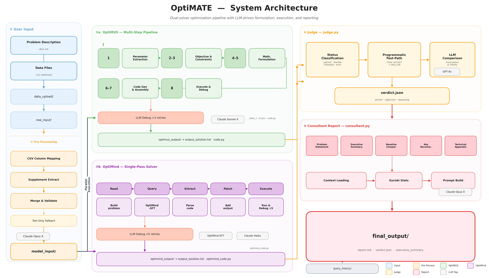

# OptiMATE

An ensemble natural-language optimization solver that runs **OptiMUS** and **OptiMind** in parallel, uses an LLM judge to pick the best solution, and generates a professional consultant-grade optimization report.

Built during **TreeHacks 2026**, with credit to the original creators of [OptiMUS](https://github.com/teshnizi/OptiMUS) and [OptiMind](https://arxiv.org/abs/2509.22979).

---

## Architecture



The pipeline flows left to right through five stages:

1. **User Input** — A problem description (`.txt`) and optional data files (`.csv`) are uploaded through the frontend.
2. **Pre-Processing** — `raw_to_model.py` uses an LLM to extract structured parameters from raw inputs, producing `desc.txt`, `params.json`, and an optional `baseline.txt`.
3. **Dual Solvers (parallel)** — Two independent solvers race to solve the problem:
   - **OptiMUS** — A structured, multi-step pipeline that decomposes the problem into parameters, objectives, and constraints, formulates each mathematically, generates GurobiPy code, and executes it with an LLM-assisted debug loop (×3 retries).
   - **OptiMind** — Microsoft Research's fine-tuned LLM (`OptiMind-SFT`) that reasons step-by-step and generates executable GurobiPy code in a single pass, with its own debug loop (×5 retries).
4. **Judge** — Classifies solver statuses, uses a programmatic fast-path for clear winners, and falls back to GPT-4o for nuanced comparison of formulation correctness, implementation fidelity, and objective values.
5. **Consultant Report** — Generates a professional Markdown report with an executive summary, baseline comparison, key recommendations, and a technical appendix.

### LLM Models

| Stage | Provider | Model |
|-------|----------|-------|
| Pre-Processing | Anthropic | `claude-opus-4-20250514` |
| OptiMUS (all steps) | Anthropic | `claude-sonnet-4-20250514` |
| OptiMind (solver) | Self-hosted (GCP) | `microsoft/OptiMind-SFT` |
| OptiMind (debug) | Anthropic | `claude-haiku` |
| Judge | OpenAI | `gpt-4o` |
| Consultant | Anthropic | `claude-opus-4-20250514` |

---

## Project Structure

```
OptiMATE/
├── frontend/                  Next.js web interface
│   ├── app/                   App router pages & API routes
│   ├── components/            React components
│   └── public/                Static assets
│
├── backend/                   Python optimization pipeline
│   ├── main.py                Entry point — runs the full pipeline
│   ├── raw_to_model.py        Converts raw inputs → structured model inputs
│   ├── optimus.py             OptiMUS solver entry point
│   ├── optimind.py            OptiMind solver entry point
│   ├── judge.py               Compares solutions, picks a winner
│   ├── consultant.py          Generates the final report
│   ├── query_manager.py       Workspace archiving & cleanup
│   ├── optimus_pipeline/      OptiMUS step implementations (steps 1–8)
│   ├── data_upload/           Drop input files here
│   ├── current_query/         Working directory (managed automatically)
│   │   ├── raw_input/
│   │   ├── model_input/
│   │   ├── optimus_output/
│   │   ├── optimind_output/
│   │   └── final_output/      verdict.json + report.md
│   └── query_history/         Archived runs (<timestamp>/)
│
└── README.md                  ← You are here
```

---

## Setup

### Prerequisites

- Python 3.10+
- Node.js 18+ and npm
- A valid [Gurobi license](https://www.gurobi.com/academia/academic-program-and-licenses/) (academic licenses are free)

### Environment Variables

Create a `.env` file in the `backend/` directory (gitignored):

```
OPENAI_API_KEY=your-openai-key
ANTHROPIC_API_KEY=your-anthropic-key
OPTIMIND_SERVER_URL=http://<VM_IP>/v1

# Gurobi WLS (cloud license — works on any machine)
GRB_WLSACCESSID=your-access-id
GRB_WLSSECRET=your-secret
GRB_LICENSEID=your-license-id
```

### Backend

```bash
cd backend
conda activate optima
pip install -r requirements.txt
```

### Frontend

```bash
cd frontend
npm install
```

### Gurobi License

The pipeline generates and executes GurobiPy code. You need a valid license:

- **Get one:** [Academic (free)](https://www.gurobi.com/academia/academic-program-and-licenses/) or [commercial](https://www.gurobi.com/licenses/). Retrieve your key from the [Gurobi User Portal](https://portal.gurobi.com/iam/licenses/list).
- **Option A — WLS (recommended):** Add your Web License Service credentials to `.env` (see above). Works on any machine.
- **Option B — Local license file:** Run `grbgetkey` to download `gurobi.lic` to `~/gurobi.lic`. Only works on that machine.

---

## Quick Start

### Backend (CLI)

```bash
cd backend

# 1. Place your files in data_upload/
#    - A .txt file with the problem description (required)
#    - A .csv file with parameter data          (optional)

# 2. Run the pipeline
python main.py
```

The script clears the workspace, processes inputs, runs both solvers in parallel, judges the results, and writes the final output to `current_query/final_output/`.

#### Alternative: explicit file paths

```bash
python main.py --desc path/to/problem.txt
python main.py --desc path/to/problem.txt --data path/to/params.csv
```

#### CLI options

```
python main.py                                    # use data_upload/
python main.py --desc problem.txt                 # explicit desc file
python main.py --desc problem.txt --data data.csv # desc + CSV
python main.py --no-archive                       # skip archiving old results
python main.py --dir other_dir                    # different workspace
```

### Frontend

```bash
cd frontend
npm run dev
```

Open [http://localhost:3000](http://localhost:3000) to use the web interface.

---

## Pipeline Detail

### What `main.py` does

| Step | What happens |
|------|-------------|
| 1 | Archive + clear `current_query/` |
| 2 | Copy uploaded files into `current_query/raw_input/` |
| 3 | `raw_to_model` — LLM converts raw inputs to `model_input/desc.txt` + `params.json` |
| 4 | `optimus` + `optimind` — **run in parallel** (structured multi-step solver + single-pass LLM solver) |
| 5 | `judge` — compares both solutions, picks a winner |
| 6 | `consultant` — generates a professional Markdown report with baseline comparison |

If one solver fails, the other's result is still judged. If both fail, you get a clear error.

---

## Backend Components

### `raw_to_model.py` — Pre-Processing

Converts `raw_input/` into `model_input/`. Two modes, chosen automatically:

- **CSV+Text mode** (raw_desc.txt + CSVs): LLM maps CSV columns to optimization parameters, then extracts additional numeric constants from the description text. Merges both sources.
- **Text mode** (raw_desc.txt only): LLM extracts parameters directly from prose.

### OptiMUS — Multi-Step Structured Pipeline

Decomposes the problem into parameters, objectives, and constraints, formulates each mathematically, generates code, then executes and debugs it. Steps 2 and 3 run **in parallel**.

| Step | File | What it does |
|------|------|--------------|
| 1 | `step01_parameters.py` | Extract parameters from the problem description |
| 2 | `step02_objective.py` | Identify the optimization objective (**parallel with 3**) |
| 3 | `step03_constraints.py` | Extract constraints (**parallel with 2**) |
| 4 | `step04_constraint_model.py` | Formulate constraints in LaTeX |
| 5 | `step05_objective_model.py` | Formulate objective in LaTeX |
| 6 | `step06_target_code.py` | Generate GurobiPy code for each constraint/objective |
| 7 | `step07_generate_code.py` | Assemble the complete solver script |
| 8 | `step08_execute_code.py` | Execute the script; if it errors, reflect and retry |

All step files live in `optimus_pipeline/`.

### OptiMind — Single-Pass LLM Solver

Microsoft Research's fine-tuned LLM for optimization. Given a natural-language problem, it reasons step-by-step and generates executable GurobiPy code in a single pass.

- **Model:** `microsoft/OptiMind-SFT` (20B params, MoE architecture with 3.6B activated)
- **Serving:** Self-hosted on a GCP VM with NVIDIA L4 GPU (24GB VRAM), served via llama.cpp with Q4_K_M quantization
- **Paper:** [OptiMind: Teaching LLMs to Think Like Optimization Experts](https://arxiv.org/abs/2509.22979)

#### OptiMind Deployment

The full-precision model (~40GB BF16) exceeds the L4's 24GB VRAM. We use offline quantization via llama.cpp's GGUF format:

1. Build llama.cpp from source with CUDA support
2. Convert HuggingFace safetensors to GGUF Q8_0 intermediate (~22GB)
3. Quantize to Q4_K_M (~15GB, fits in 24GB VRAM)
4. Serve with `llama-server` with all layers offloaded to GPU

An nginx reverse proxy on port 80 forwards to llama-server on port 30000. For step-by-step setup, see **[backend/docs/OPTIMIND_GOOGLE_CLOUD_SETUP.md](backend/docs/OPTIMIND_GOOGLE_CLOUD_SETUP.md)**.

### Judge — Solution Comparison

1. **Status classification** — `optimal`, `feasible`, `infeasible`, `unbounded`, `error`, `no_result`
2. **Programmatic fast-path** — Clear winners (one crashed, one succeeded) skip the LLM
3. **LLM comparison** — GPT-4o evaluates formulation correctness, fidelity, and objective value
4. **Sanity override** — Prevents the LLM from picking crashed solvers

### Consultant — Report Generation

Produces a professional client-ready Markdown report:

- **Executive Summary** — C-suite ready, no jargon
- **Baseline Comparison** — Compares against the client's current strategy (from `baseline.txt`)
- **Key Recommendations** — Numbered, actionable implementation steps
- **Technical Appendix** — Mathematical formulation, variable values, solver statistics, and code

---

## Known Issues & Future Work

### 1. OptiMind: Data Truncation in Generated Code

**Problem:** OptiMind receives full raw parameter values in its prompt (e.g. 1,190-element vectors). The LLM cannot reproduce all values in generated code, so it truncates arrays, causing runtime crashes.

**Proposed fix:** Change `_read_problem()` so it provides a data summary instead of raw values, and instruct the LLM to read `params.json` from disk at runtime.

### 2. OptiMUS: Fragile Constraint Formulation Parser

**Problem:** Character-by-character string scanning in `step04_constraint_model.py` breaks when the LLM formats responses slightly differently than expected.

**Proposed fix:** Replace with regex-based extraction or a two-pass strategy (extract JSON first, then pull LaTeX from JSON values).

### 3. Constraint Description Format Inconsistency

**Problem:** Step 3 sometimes returns constraint descriptions as nested dicts instead of plain strings, confusing downstream steps.

**Proposed fix:** Add a normalization step that ensures every constraint description is a plain string.

### 4. Baseline Extraction from User Input

**Problem:** `baseline.txt` must be manually created. No automated way to separate a user's input into problem description and baseline strategy.

**Proposed fix:** Add a preprocessing LLM step that splits raw input into `desc.txt` and `baseline.txt`.

### 5. Inaccurate Parameter Extraction from CSVs

**Problem:** `raw_to_model.py` frequently produces incorrect results with structured CSV formats (flattening key-value data, missing parameters, type confusion).

**Proposed fixes:** Stronger prompt engineering with more sample rows, multi-pass extraction with validation, schema detection pre-step, or human-in-the-loop review.
